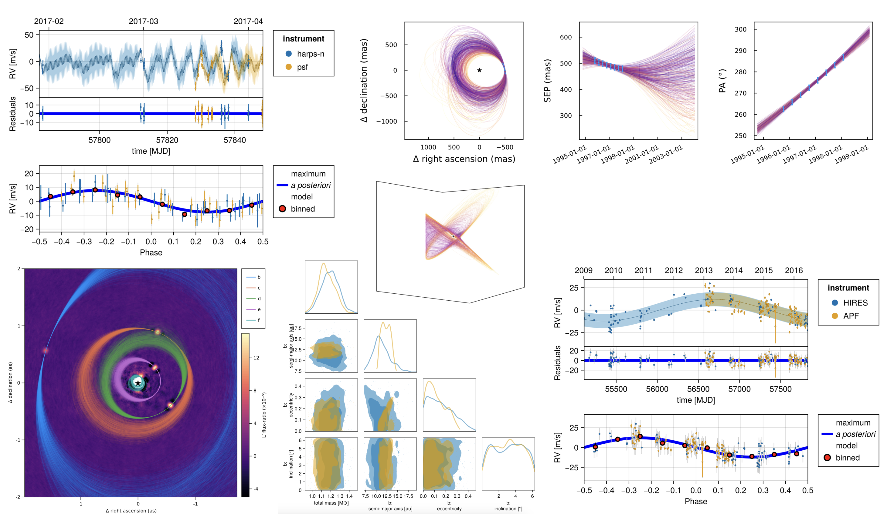
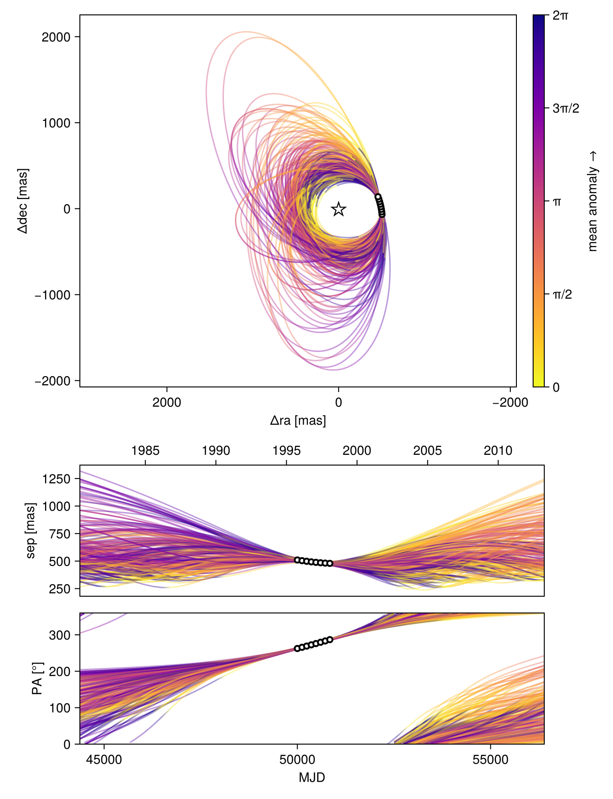
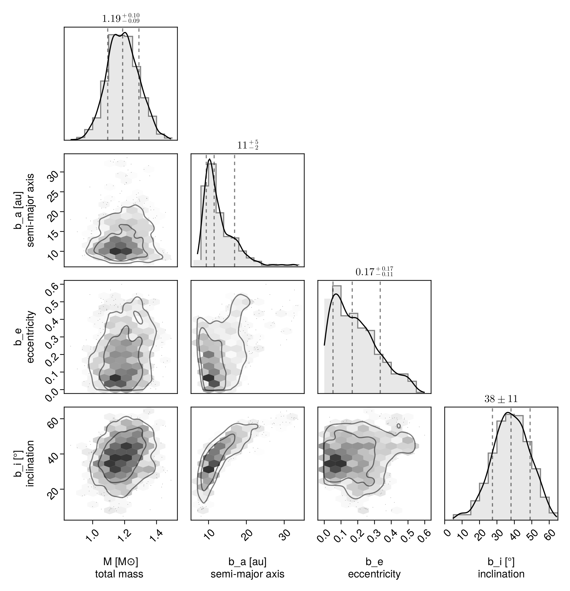

# octofitterpy

`octofitterpy` is a python package for performing Bayesian inference 
against a wide variety of exoplanet / binary star data. It uses the [Octofitter.jl](https://sefffal.github.io/Octofitter.jl/)
julia package under the hood (just like eg numpy uses C).

`octofitterpy` can access almost all functionality of Octofitter.jl. Currently a subset of this functionality including relative astrometry fitting, absolute astrometry fitting, and various plotting functions have been wrapped with convenient python functions. Remaining functionality can be accessed via the `octofitterpy.Octofitter` submodule.


The `examples` directory and [demo notebook](https://github.com/sefffal/octofitterpy/blob/master/examples/demo.ipynb) provide an introduction to using octofitter in Python.
Extensive documentation and tutorials are available [here](https://sefffal.github.io/Octofitter.jl/) for the Julia version, and for the most part are directly translatable to Python.



## Installation
In python 3.8 to 3.11 based environment, run:
```bash
pip install -U octofitterpy
```

## Example
```python
import octofitterpy as octo

# See demo.ipynb for more details
astrom_like = octo.PlanetRelAstromLikelihood(
    epoch = [50000,50120],
    sep = [505.7,600.1],
    pa = [0.0,0.4,],
    σ_sep = [10,10],
    σ_pa = [0.01,0.01],
    cor= [0,0.2]
)
planet_b = octo.Planet(
    name="b",
    basis="Visual{KepOrbit}",
    priors=
    """            
        a ~ LogUniform(0.1, 500)
        e ~ Uniform(0.0, 0.99)
        i ~ Sine()
        ω ~ UniformCircular()
        Ω ~ UniformCircular()
        θ ~ UniformCircular()
        tp = θ_at_epoch_to_tperi(system,b,50000) # use MJD epoch of your data here!!
    """,
    likelihoods=[astrom_like]
)
sys = octo.System(
    name="HIP100123",
    priors = 
    """
        M ~ truncated(Normal(1.2, 0.1), lower=0)
        plx ~ truncated(Normal(50.0, 0.02), lower=0)
    """,
    likelihoods=[],
    companions=[planet_b]
)
model = octo.LogDensityModel(sys) # Compile model
chain = octo.octofit(model) # Sample model
octo.octoplot(model,chain) # Plot orbits
octo.octocorner(model,chain,small=True) # Make corner plot
octo.savechain("table.fits", chain)
```





## Read the paper
In addition to these documentation and tutorial pages, you can read the paper published in the [Astronomical Journal](https://dx.doi.org/10.3847/1538-3881/acf5cc) (open-access).

## Attribution
* If you use Octofitter in your work, please cite [Thompson et al](https://dx.doi.org/10.3847/1538-3881/acf5cc):
```bibtex
@article{Thompson_2023,
    doi = {10.3847/1538-3881/acf5cc},
    url = {https://dx.doi.org/10.3847/1538-3881/acf5cc},
    year = {2023},
    month = {sep},
    publisher = {The American Astronomical Society},
    volume = {166},
    number = {4},
    pages = {164},
    author = {William Thompson and Jensen Lawrence and Dori Blakely and Christian Marois and Jason Wang and Mosé Giordano and Timothy Brandt and Doug Johnstone and Jean-Baptiste Ruffio and S. Mark Ammons and Katie A. Crotts and Clarissa R. Do Ó and Eileen C. Gonzales and Malena Rice},
    title = {Octofitter: Fast, Flexible, and Accurate Orbit Modeling to Detect Exoplanets},
    journal = {The Astronomical Journal},
}
```

* If you use the pairplot functionality, please cite:
```
@misc{Thompson2023,
    author = {William Thompson},
    title = {{PairPlots.jl} Beautiful and flexible visualizations of high dimensional data},
    year = {2023},
    howpublished = {\url{https://sefffal.github.io/PairPlots.jl/dev}},
}
```

* The python wrapper octofitterpy is based on the excellent [PySR by Miles Cranmer](https://github.com/MilesCranmer/PySR). 

* See the documentation for a list of additional papers to consider citing.

## Ready?

Start by following this [tutorial](https://github.com/sefffal/octofitterpy/blob/master/examples/demo.ipynb).
